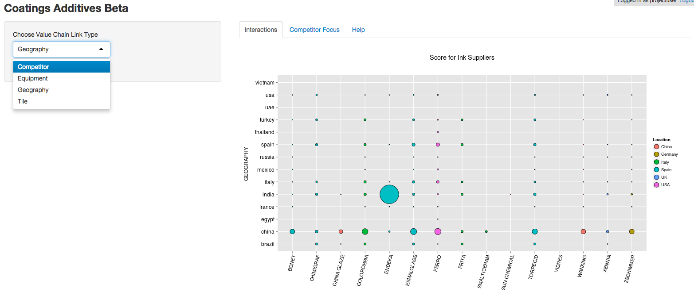
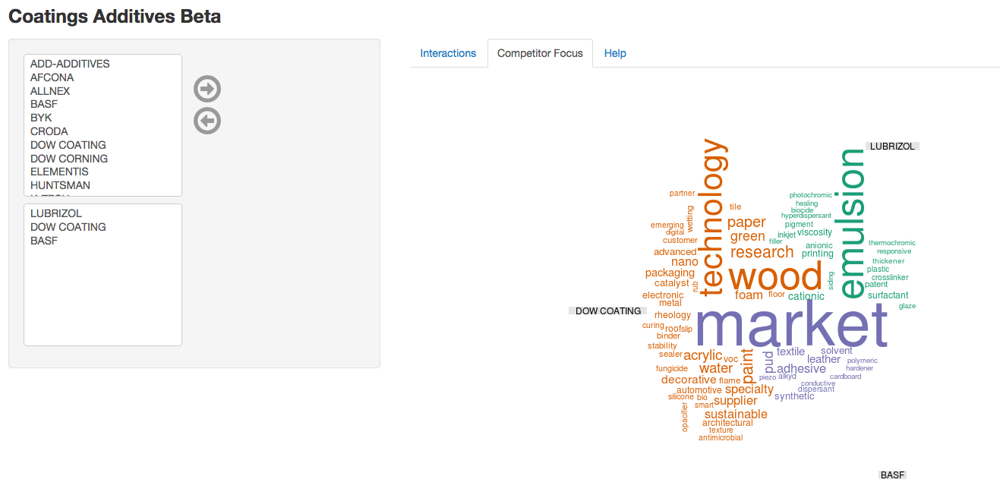

## Ink manufacturers value chain insights

Here are some insights based on the value chain analysis of ink manufacturers

- Prominent supplier relationships in Spain - Chimigraf & BASF, Esmalglass & BYK
- Xennia vertical integration with inks and equipment
- China presence for most but India Dominance by Endeka
- Top tile customers for Endeka inks - Roca, Kale, Corona    

--- .class #id 

## Interface to study dynamic value chain interactions

<div style='text-align: center;'>
    
</div>

--- .class #id 

## Diving deeper - What do the Coatings Additives Suppliers focus on?

- Dow dominance in key markets - wood, paint, paper, automotive
- Different functional focus - BASF in dispersants, Dow in antimicrobial, Lubrizol in emulsions
- Innovation areas - smart coatings (Dow) , conductive (BASF) , photochromic (Lubrizol)

Total Market Value(Billion $) of Ink is
```{r}
p<-100
q<-23
x<-p*q
x
```

--- .class #id 

## Interface to study supplier focus

<div style='text-align: center;'>
    
</div>

